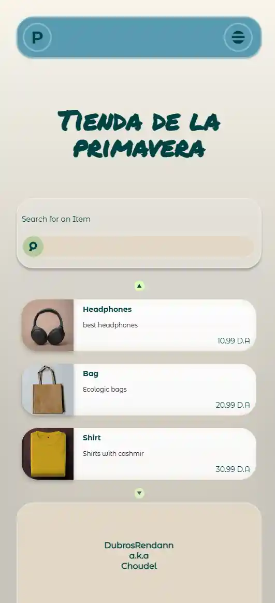
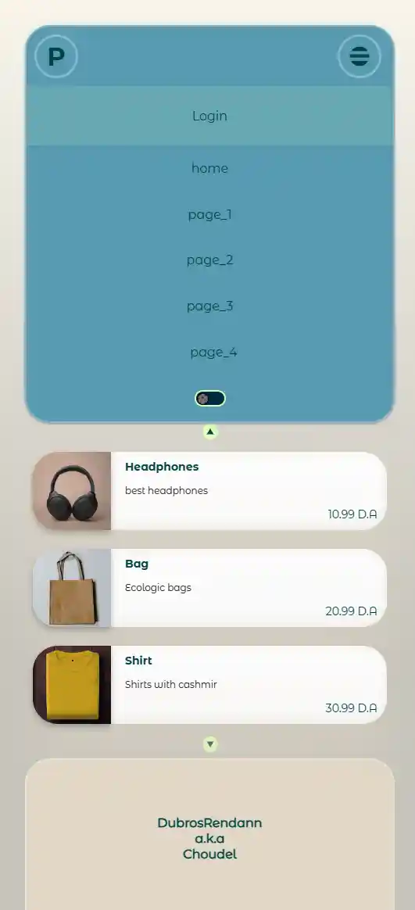
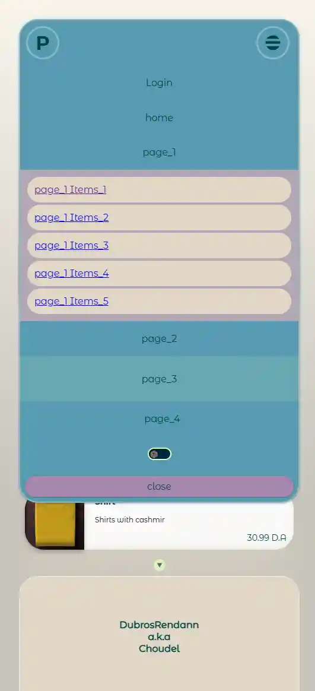
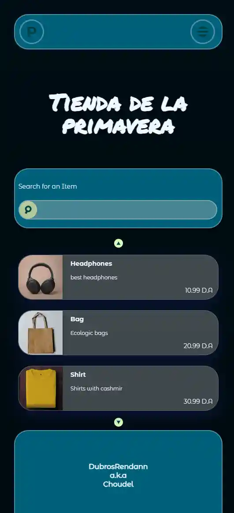
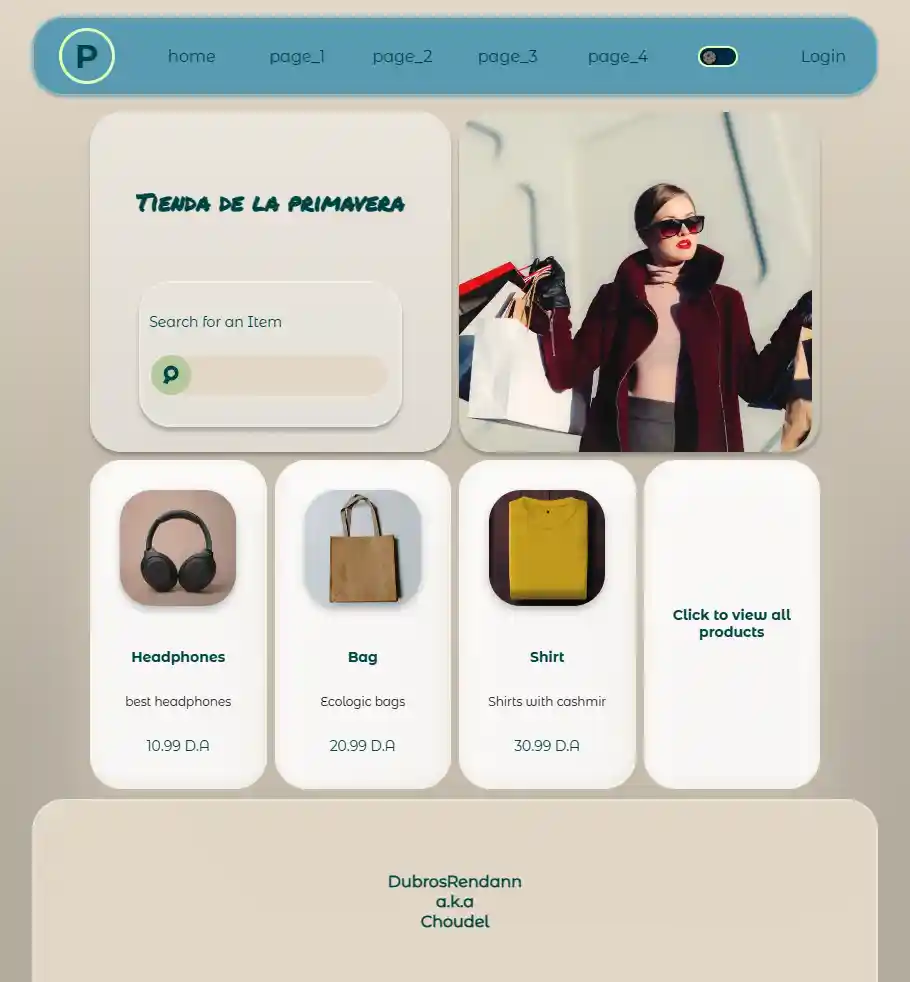
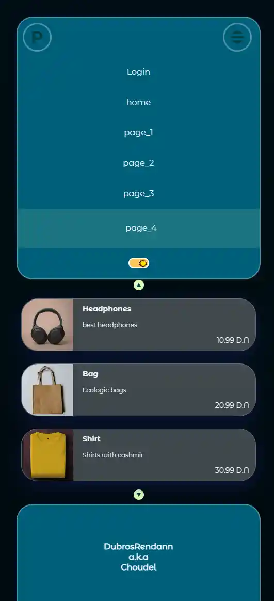
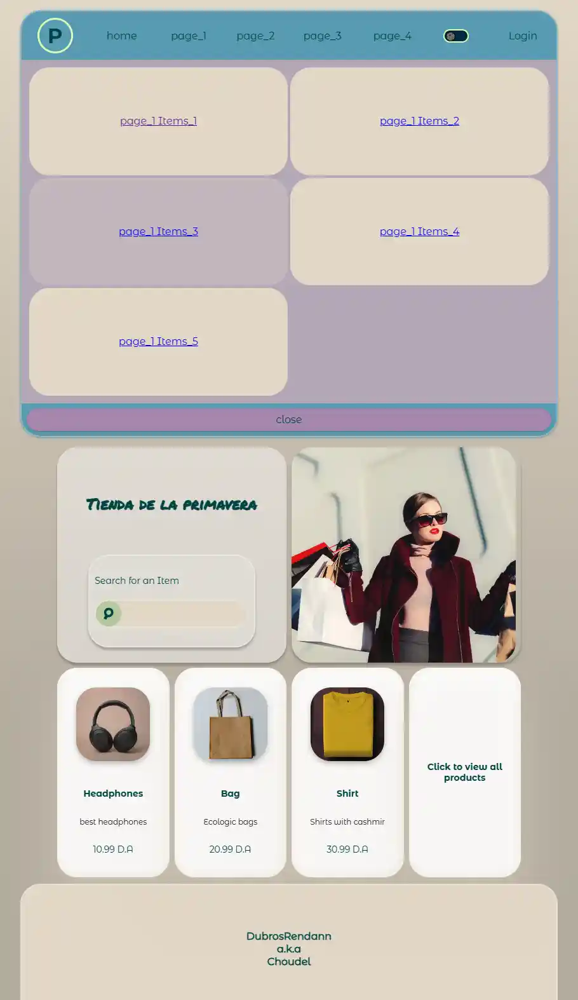
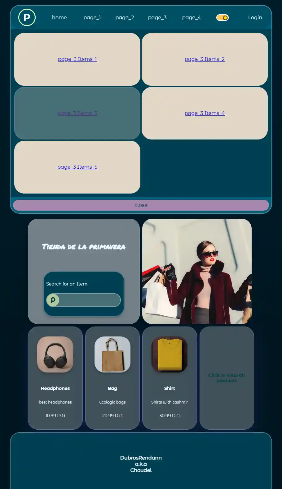

Tienda de la primevera store , My portfolio demonstrator project using the folloing stack :

##frontend:##
SvelteKit + scss
Graphql client urql with JWT authentication implemented

##Backend:(published on another repo)##
NestJS 
Postgraphile library implementation with authentication , roles , auth , rate limitation and query cost limitation 
Implementation of subscriptions  

------------------------------------------------
Once you've cloned a project and installed dependencies with `npm install` (or `pnpm install` or `yarn`), start a development server:

```bash
npm run dev

# or start the server and open the app in a new browser tab
npm run dev -- --open
```
##UI features:##
Fully responsive design 
Light/Dark mode without flickering 
Responsive Navbar with the best User experience for both mobile and desktop 











